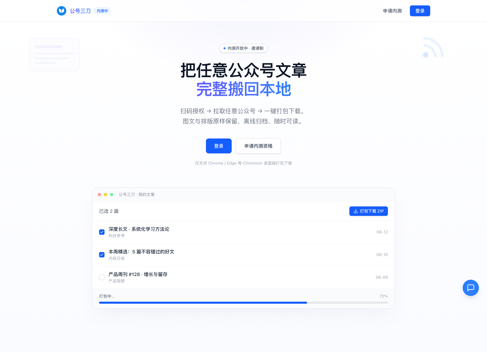
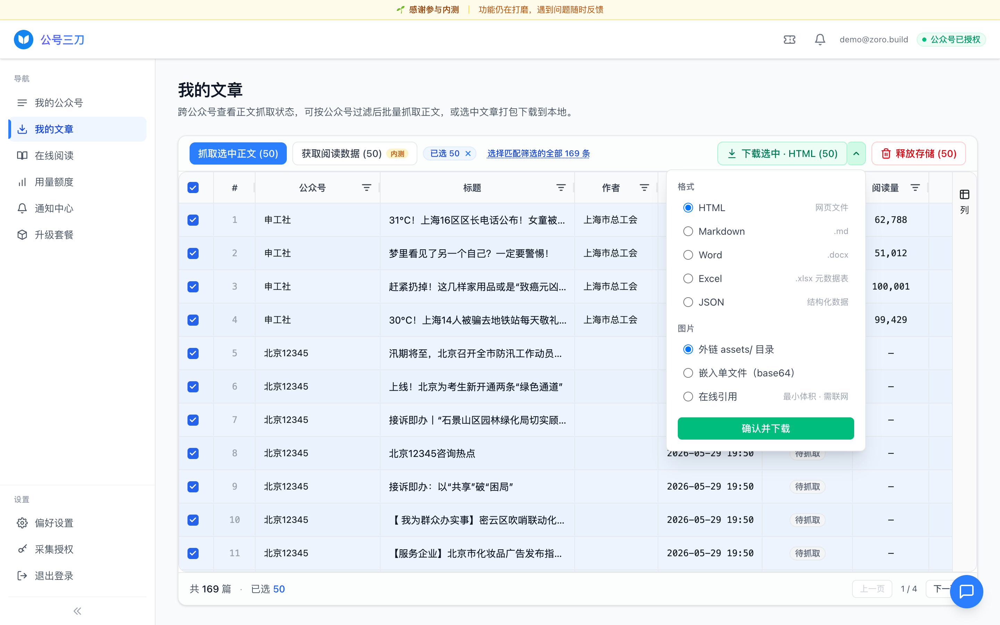
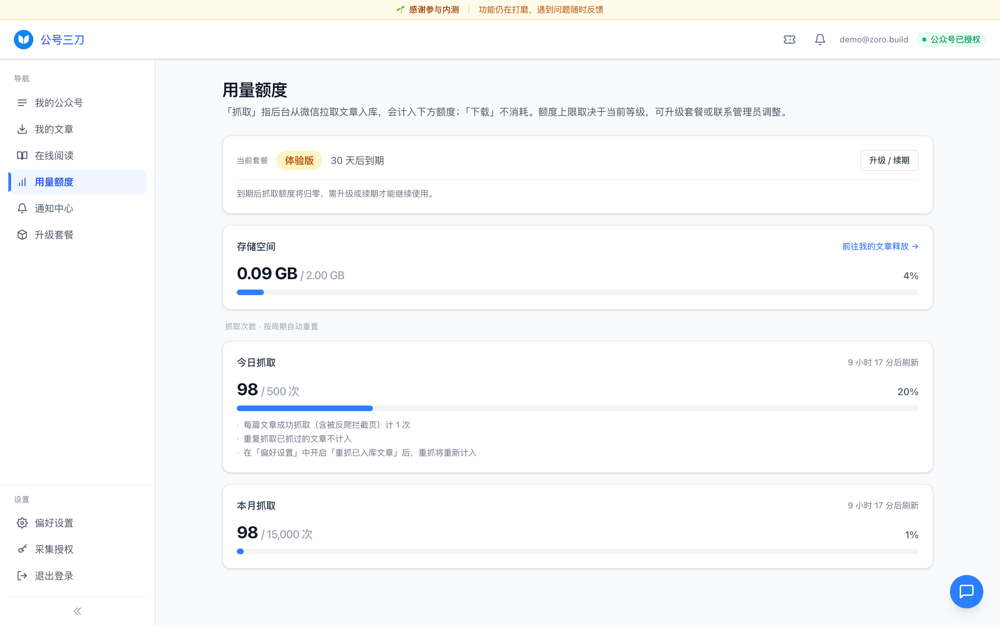

# 公号三刀

**把任意公众号文章完整搬回本地**

扫码授权 → 拉取任意公众号 → 一键打包下载。图文与排版原样保留，离线归档、随时可读。

[在线体验 wechat.zoro.build](https://wechat.zoro.build) · 内测开放中 · 邀请制

---

## 这是什么

公号三刀是一个**微信公众号文章在线下载工具**。你只需用微信扫码授权一次，就能搜索任意公众号、把它的历史图文连同排版与图片完整抓取到自己的账户，然后在线阅读，或一键打包成 HTML / Markdown / Word 下载到本地长期归档。

- 📦 **原样保留**：图文排版、配图与样式照搬，离线打开和在微信里看几乎一致。
- 🗂️ **批量高效**：跨多个公众号搜索、拉取、抓取、打包，一次处理成百上千篇。
- 🔌 **开箱即用**：抓取通道由我们维护，无需自己折腾代理，新手也能直接用。
- 🔒 **授权可控**：授权凭证存在你自己的账户里，可随时撤销或切换。

> 仅支持 Chrome / Edge 等 Chromium 桌面端进行打包下载；Firefox / Safari 仍可在线阅读与导出元数据。

---

## 核心功能

### 1. 扫码授权公众号

用微信扫码授权你自己的公众号，获得"拉取文章身份"。授权后约 3 天内可免扫码切换到同一微信号下的其他公众号；凭证随时可在「采集授权」页撤销或更换。

### 2. 搜索与添加公众号

按关键词搜索任意公众号并加入抓取列表，数量不限。可对一个或多个公众号批量发起拉取，按发布时间从新到旧抓取其历史文章列表，支持设置截止时间，并可随时暂停 / 继续 / 取消，实时查看每个号的进度。

### 3. 一键抓取正文

勾选文章即可批量把图文正文抓进你的账户，排版原样保留。图片自动重试、缺图会有提示；同一篇文章跨账号共享去重，不会重复抓取、不重复消耗额度。

### 4. 在线阅读

内置双栏阅读器，左侧文章列表、右侧正文即点即看。先在线浏览确认排版与内容，再决定要不要打包下载。

### 5. 批量打包下载 · 多格式导出

把选中的文章导出为 **HTML / Markdown / Word（DOCX）**，单篇或批量（批量自动打包成 ZIP）：

- **图片三种模式**（HTML / Markdown）：内嵌离线（单文件 base64）/ 外链 assets 目录 / 在线引用；Word 图片固定内嵌。
- **目录与文件命名可自定义**。
- 打包过程在浏览器本地完成，文件直接落到你选定的磁盘目录。

### 6. 元数据导出（Excel / JSON）

把选中文章的元数据汇成一份表格或结构化数据，方便统计与归档。包含字段：

> 公众号、标题、作者、发布时间、原文链接、摘要、阅读数、喜欢数、在看数、转发数、评论数、是否原创、是否付费、抓取状态。

导出时还可选择附带每篇正文（Markdown）。其中**阅读 / 喜欢 / 在看 / 转发 / 评论等互动数据**属于「阅读数据采集」能力（见下），普通元数据无需额外授权即可导出。

### 阅读数据采集（内测中）

在已授权对应公众号的前提下，可为选中文章采集**阅读 / 点赞 / 分享 / 喜欢 / 留言数以及留言内容**，补全上面的互动数据。该功能为内测阶段、仍在完善，每篇会消耗 1 次抓取额度。

---

## 三步开始

| 步骤 | 做什么 |
| :--: | ------ |
| **01 扫码授权** | 微信扫码授权你自己的公众号，获得拉取文章身份 |
| **02 拉取并抓取** | 搜索想要的任意公众号，拉取历史文章列表，再一键抓取图文正文 |
| **03 打包 / 导出** | 批量打包 ZIP 下载到本地，或导出元数据归档 |

---

## 用量与套餐

- 提供**免费体验版**与**付费套餐**两类；抓取额度按"正文篇数"计，分每日 / 每月两档（分别按北京时间每天 0 点、每月 1 号重置）。
- **文章元数据与可添加的公众号数量不限**，不占用抓取额度。
- 抓取每篇文章正文计 1 次额度；同一篇已抓取过不重复计费，抓取失败（如网络错误）不消耗额度。
- 抓取的正文存在你的账户存储空间里，可随时"释放存储"腾出空间或重新抓取。

> 各档价格、容量与开通方式请见 [站点套餐说明](https://wechat.zoro.build/#plans)（暂未开放在线购买，开通 / 升级 / 续期请联系客服）。

---

## 与开源版的关系

公号三刀脱胎于开源项目 **[wechat-article-exporter](https://github.com/wechat-article/wechat-article-exporter)**（在线站点 [down.mptext.top](https://down.mptext.top)），由原作者打造，是它的**商业增强版**。

| | 开源版 | 公号三刀（本项目） |
| --- | --- | --- |
| 价格 | 完全开源、免费自用 | 免费体验 + 付费套餐 |
| 抓取通道 | 依赖公共代理节点，**每天额度有限、需要"抢额度"** | **由我们维护，开箱即用，无需关心代理** |
| 稳定性 | 功能相对有限、可能存在 bug | 更稳定、功能更丰富 |
| 适合谁 | 愿意自己折腾、动手能力强的用户 | 希望"打开就能用"的普通用户 |

如果你喜欢折腾、想完全免费自托管，欢迎使用开源版；如果你想省心稳定、不想被代理额度卡住，公号三刀帮你把这些麻烦都解决了。

---

## 即将推出

- **RSS 订阅（开发中）**：未来将支持把关注的公众号生成 RSS 订阅源，在你常用的阅读器里直接追更。该功能尚在开发，当前版本暂未提供。

---

## 常见问题

**支持哪些浏览器？**
打包下载依赖浏览器的本地文件系统能力，仅支持 Chrome / Edge 等 Chromium 桌面端；Firefox / Safari 暂不支持打包下载，但仍可在线阅读与导出元数据。

**一篇文章消耗多少额度？**
抓取一篇正文计 1 次抓取额度。已抓取过的同一篇不重复计；抓取失败不消耗额度。每日 / 每月额度按北京时间每天 0 点、每月 1 号重置。

**抓取的文章存在哪里？**
存在你账户的存储空间里并计入存储配额，可随时释放存储以腾出空间或重新抓取。

**能抓几个公众号？**
可添加的目标公众号不限数量；实际能抓多少取决于你的每日 / 每月额度与存储空间。

**授权信息安全吗？**
扫码授权仅用于代你读取有权限的公众号文章；凭证存在你的账户，可在「采集授权」页随时撤销或切换。

**如何获得内测资格？**
当前为邀请制内测，前往[在线站点](https://wechat.zoro.build)申请邀请码后即可注册登录。

---

## 反馈与建议

本仓库用于收集公号三刀的使用反馈与功能建议。遇到问题、有想要的功能，欢迎[提交 Issue](../../issues) 告诉我们 🙌

在线体验：**[wechat.zoro.build](https://wechat.zoro.build)**
