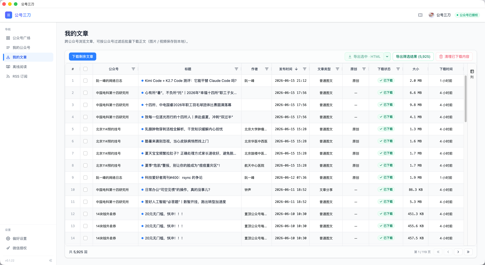
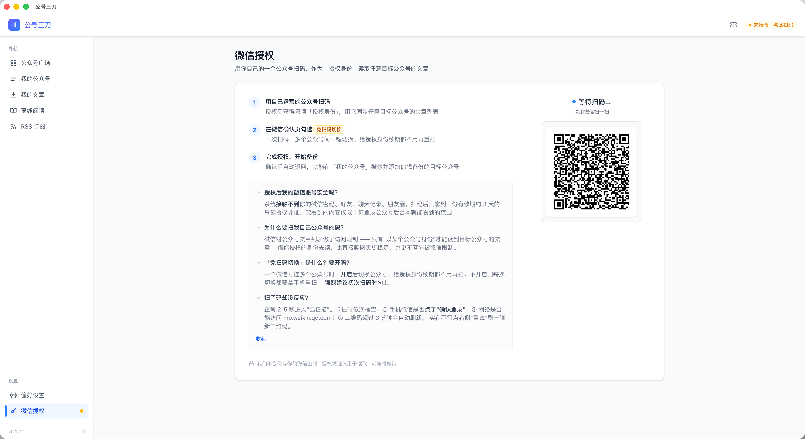
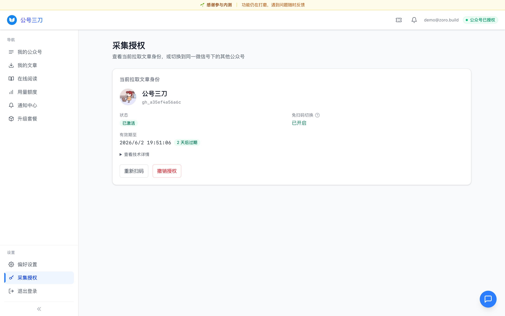
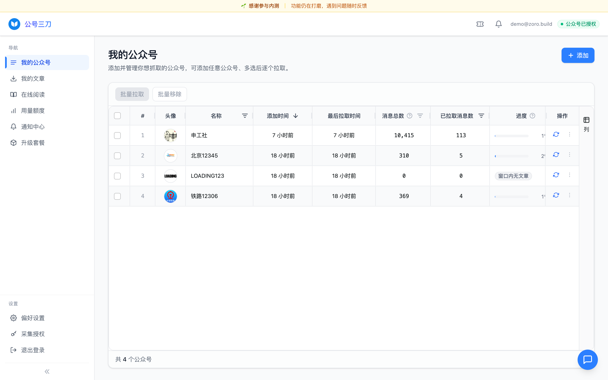
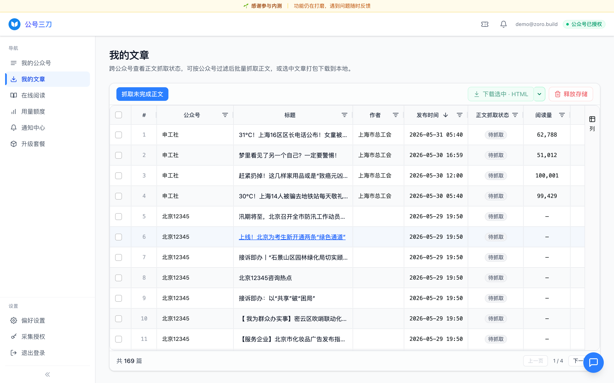
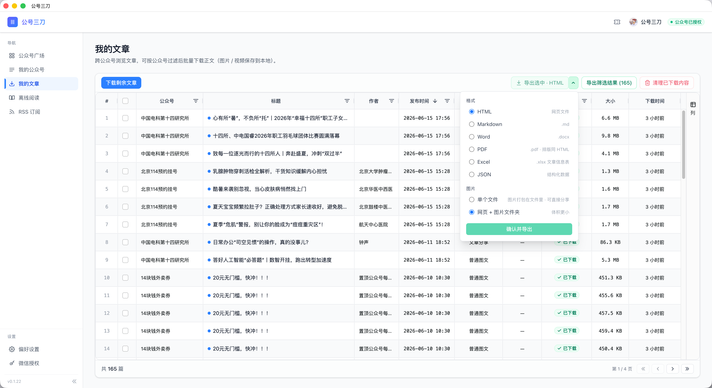
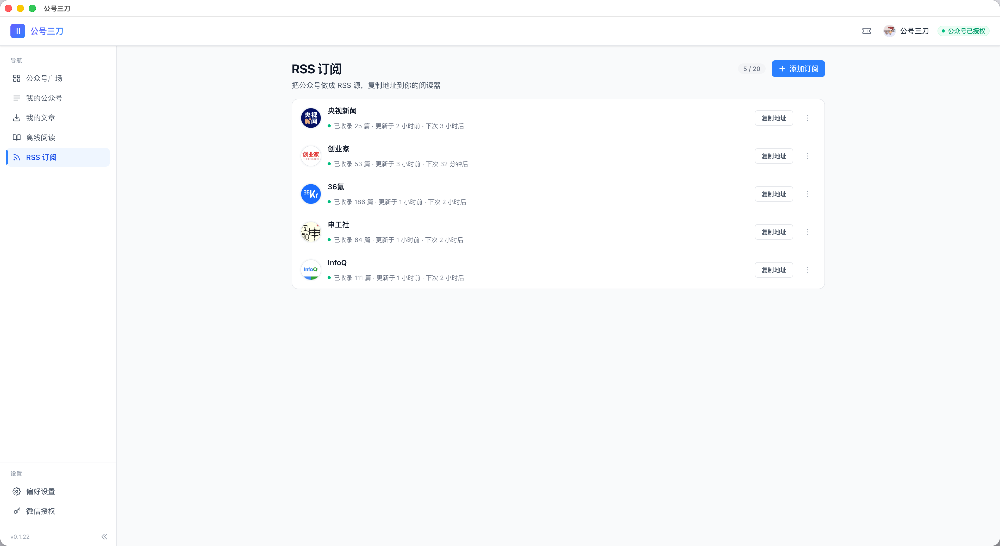

# 公号三刀

**把任意公众号文章完整搬回本地**

扫码授权 → 拉取任意公众号 → 导出归档（HTML / Markdown / Word / PDF / EPUB）。
 
图文与排版原样保留，离线随时可读。

[⬇️ 下载 Windows 客户端][dl-win] · [⬇️ 下载 macOS 客户端（Apple 芯片）][dl-mac]

公开下载 · 关注公众号领码注册 · 支持 Windows 与 macOS（Apple 芯片）

---

## 这是什么

公号三刀是一款**微信公众号文章下载桌面客户端**（支持 Windows 与 macOS，后者仅 Apple 芯片）。你只需用微信扫码授权一次，就能搜索任意公众号、把它的历史图文连同排版与图片/视频完整抓取到本地，然后离线阅读，或一键导出成 HTML / Markdown / Word / PDF / EPUB 长期归档。

- 📦 **原样保留**：图文排版、配图与样式照搬，离线打开和在微信里看几乎一致。
- 🗂️ **批量高效**：跨多个公众号搜索、抓取、导出，一次处理成百上千篇。
- 🔌 **开箱即用**：抓取通道由我们维护，无需自己折腾代理，新手也能直接用。
- 💻 **本地优先 · 离线归档**：抓取的文章存在本机，离线随时可读，数据握在自己手里。
- 🪟 **托盘常驻 · 后台运行**：关闭窗口即收进系统托盘继续跑，同步 / 抓取 / 导出等任务不中断。
- 🚀 **不限抓取额度 · 本地无容量限制**：抓取正文不计额度，本地存储不设容量上限。
- 🔒 **授权可控**：扫码授权仅用于代你读取有权限的公众号文章，可随时撤销或切换。

---

## 下载与安装

- **Windows**（Windows 10 及以上，x64）：[下载安装包][dl-win]（或前往 [Releases][download] 取 `sanji-<版本>-setup.exe`），双击安装即可。
- **macOS**（Apple 芯片 / M 系列）：[下载安装包][dl-mac]（或前往 [Releases][download] 取 `sanji-<版本>-arm64.dmg`），打开后拖入「应用程序」即可。
- **自动更新**：安装一次后，客户端会自动检查并在后台静默下载更新，无需再手动下载。

> **使用前提**：① 登录已激活的**公号三刀账号**（在我们的网站注册并激活，不是你的微信账号）；② **拥有你自己的微信公众号**——用于扫码授权，作为拉取文章的身份。详见下方[三步开始](#三步开始)。

---

## 核心功能

### 1. 扫码授权公众号

用微信扫码授权**你自己的公众号**，获得"拉取文章身份"。授权后短期内可免扫码切换到同一微信号下的其他公众号；凭证随时可在「微信授权」页撤销或更换。

### 2. 公众号广场 · 搜索与添加

在「公众号广场」按分类浏览精选公众号一键添加，或按关键词搜索任意公众号加入抓取列表，数量不限。可对一个或多个公众号批量发起拉取，按发布时间从新到旧抓取历史文章列表，支持设置截止时间，并可随时暂停 / 继续 / 取消，实时查看每个号的进度。

若你此前用过开源版的导出工具，已添加的公众号可在那边「批量导出」为 JSON 文件，回到客户端「我的公众号 → 批量导入」选文件或拖拽，即可一次性导入、免去逐个重搜。

### 3. 文章同步与一键抓取正文

勾选文章即可批量把图文正文抓到本地，排版原样保留。图片自动重试、缺图会有提示；同一篇文章自动去重，不会重复抓取。

### 4. 离线阅读

内置阅读器，左侧文章列表、右侧正文即点即看，**完全离线**——已抓取的文章无需联网即可阅读。

### 5. 多格式导出（HTML / Markdown / Word / PDF / EPUB / ZIP）

把选中的文章导出为 **HTML / Markdown / Word（DOCX）/ PDF / EPUB**，单篇或批量（批量自动打包成 ZIP）：

- **EPUB 合并成书**：多篇可合并成一本多章 EPUB 电子书，过大时自动分卷；书中视频降级为封面图（不内嵌 mp4）。
- **图片2种模式**（HTML / Markdown）：内嵌离线（单文件 base64）/ 外链 assets 目录；Word、PDF 图片固定内嵌。
- **目录与文件命名可自定义**。
- 文件直接落到你选定的磁盘目录。

### 6. RSS 订阅

把关注的公众号生成 RSS 订阅源，在 Reeder / NetNewsWire 等任意阅读器里直接追更。可复制单个公众号链接、复制把全部订阅合并成一条的订阅源，或一键导出 OPML 批量导入阅读器。可按订阅自定义拉取间隔，新文章自动入库。

### 7. 托盘常驻 · 关窗后台运行

关闭主窗口不会退出程序——客户端自动收进系统托盘后台运行，同步、抓取、导出等任务照常进行、不受影响；托盘图标实时显示任务进度，任务完成还会弹出系统通知。需要彻底退出时，用托盘菜单的「退出」即可。

### 8. 元数据导出（Excel / JSON）

把选中文章的元数据汇成一份表格或结构化数据，方便统计与归档。包含字段：

> 公众号、标题、作者、发布时间、原文链接、摘要、阅读数、喜欢数、在看数、转发数、评论数、是否原创、是否付费、抓取状态。

导出时还可选择附带每篇正文（Markdown）。其中**阅读 / 喜欢 / 在看 / 转发 / 评论等互动数据**依赖下面的「互动数据采集」能力，该能力当前暂不可用，相关字段会留空。

### 互动数据采集（实验性功能 · 暂不可用）

「互动数据」指一篇文章的**阅读数、喜欢数（点赞）、在看数、转发数、评论数，以及留言内容**等公开互动指标。计划在已授权对应公众号的前提下，为选中文章采集这些数据，补全上面元数据表中的互动字段。该功能为**实验性功能，目前暂不可用**，待开放后再行支持。

---

## 三步开始

> 前提：拥有你自己的微信公众号（服务号和订阅号皆可）。
> 
> 还没有公众号？去[微信公众号官网](https://mp.weixin.qq.com)免费注册。

| 步骤 | 做什么 |
| :--: | ------ |
| **01 下载并激活** | 下载安装 Windows 客户端，登录已激活的公号三刀账号（我们网站的账号） |
| **02 授权并拉取** | 用自己的公众号扫码授权，搜索想要的任意公众号，拉取历史文章列表 |
| **03 抓取 / 导出** | 一键抓取图文正文，离线阅读，或批量导出 HTML / Markdown / Word / PDF / EPUB 归档 |

> **第一步需要邀请码**：注册公号三刀账号为邀请制。用微信**扫码 / 长按识别**下方二维码关注公众号「公号三刀」，关注后会自动收到邀请码和一键注册链接，凭码在[站点](https://wechat.zoro.build)注册登录。

---

## 购买与授权

- **购买方式**：提供**一次性买断 / 按年 / 按月**三种，按需选择；**购买期限内提供功能更新与问题修复**。
- **不限抓取额度**：抓取正文不计额度，已抓取的同一篇自动去重、不重复抓取。
- **本地存储不限容量**：抓取的文章存在本机磁盘，离线可读，不设容量上限。
- 可添加的公众号数量不限，文章元数据导出不限。

> 各档价格与开通 / 续期方式请见 [站点说明](https://wechat.zoro.build/#pricing) 或联系客服（暂未开放在线购买）。

---

## 与开源版的关系

公号三刀脱胎于开源项目 **[wechat-article-exporter](https://github.com/wechat-article/wechat-article-exporter)**（在线站点 [down.mptext.top](https://down.mptext.top)），由原作者打造，是它的**商业增强版**。

| | 开源版 | 公号三刀（本项目） |
| --- | --- | --- |
| 价格 | 完全开源、免费自用 | 买断 / 按年 / 按月可选 |
| 抓取通道 | 依赖公共代理节点，**每天额度有限、需要"抢额度"** | **由我们维护，开箱即用，不限抓取额度** |
| 稳定性 | 功能相对有限、可能存在 bug | 更稳定、功能更丰富 |
| 适合谁 | 愿意自己折腾、动手能力强的用户 | 希望"打开就能用"的普通用户 |

如果你喜欢折腾、想完全免费自托管，欢迎使用开源版；如果你想省心稳定、不想被代理额度卡住，公号三刀帮你把这些麻烦都解决了。

---

## 常见问题

**支持哪些系统？**
支持 Windows 10 及以上（x64）与 macOS（Apple 芯片 / M 系列）。客户端内置自动更新，安装一次后会自动保持最新。

**用之前需要准备什么？**
两样东西：① 一个**公号三刀账号**（我们网站的账号，在 [wechat.zoro.build](https://wechat.zoro.build) 注册并激活，注意它不是你的微信账号）；② **你自己的微信公众号**——授权时用它扫码，作为拉取文章的身份。还没有公众号？可在[微信公众号官网](https://mp.weixin.qq.com)免费注册。

**有抓取额度 / 容量限制吗？**
没有。桌面客户端**不限抓取额度**，本地存储也**不设容量上限**；已抓取过的同一篇自动去重、不重复抓取。

**抓取的文章存在哪里？**
存在你本机的磁盘上，离线随时可读；账号与授权信息在云端。

**能采集阅读 / 点赞等互动数据吗？**
「互动数据采集」（阅读数、喜欢数、在看数、转发数、评论数及留言内容）目前为**实验性功能、暂不可用**，待开放后再行支持。

**能抓几个公众号？**
可添加的目标公众号不限数量。

**一个账号能在几台设备上用？**
一个公号三刀账号最多同时激活 2 台设备。可在客户端或账户页查看已激活设备并随时解绑，腾出名额给新设备。

**授权信息安全吗？**
扫码授权仅用于代你读取有权限的公众号文章；凭证可在「微信授权」页随时撤销或切换。本工具不会索取或保存你的微信账号密码。

**如何获得使用资格？**
安装包公开可下载，但使用需登录账号；当前注册为邀请制，关注微信公众号「公号三刀」即可自动获取邀请码，凭码前往[站点](https://wechat.zoro.build)注册登录。

---

## 反馈与建议

本仓库用于发布桌面客户端、收集使用反馈与功能建议。遇到问题、有想要的功能，欢迎[提交 Issue][issue] 告诉我们 🙌

> 公号三刀是第三方文章下载工具，与微信、腾讯公司无隶属或授权关系，不会索取或保存你的微信账号密码。

<!-- 外部链接统一在此维护：改地址只需改这一行 -->
[download]: https://github.com/zoro-build/wechat/releases
[dl-win]: https://dl.zoro.build/sanji/download/win
[dl-mac]: https://dl.zoro.build/sanji/download/mac
[issue]: https://github.com/zoro-build/wechat/issues
