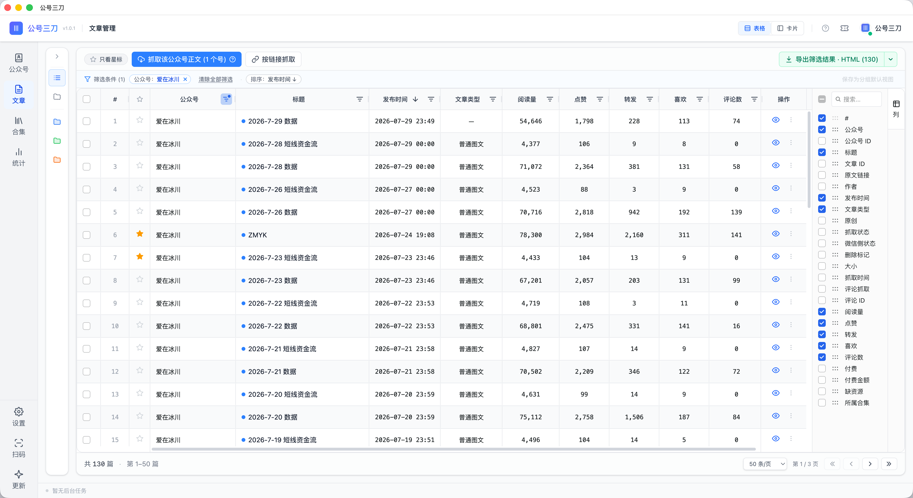
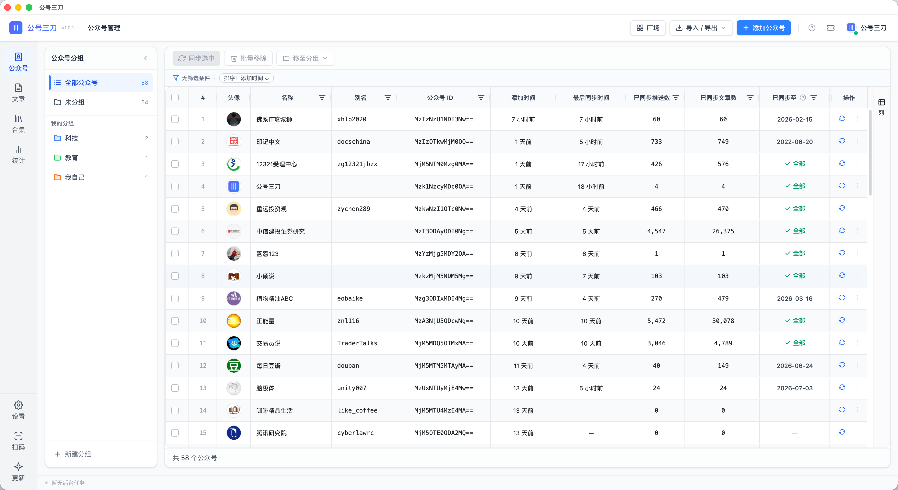
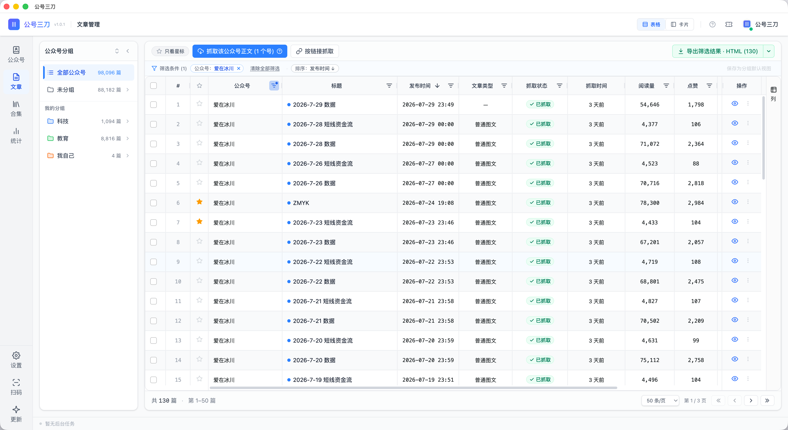
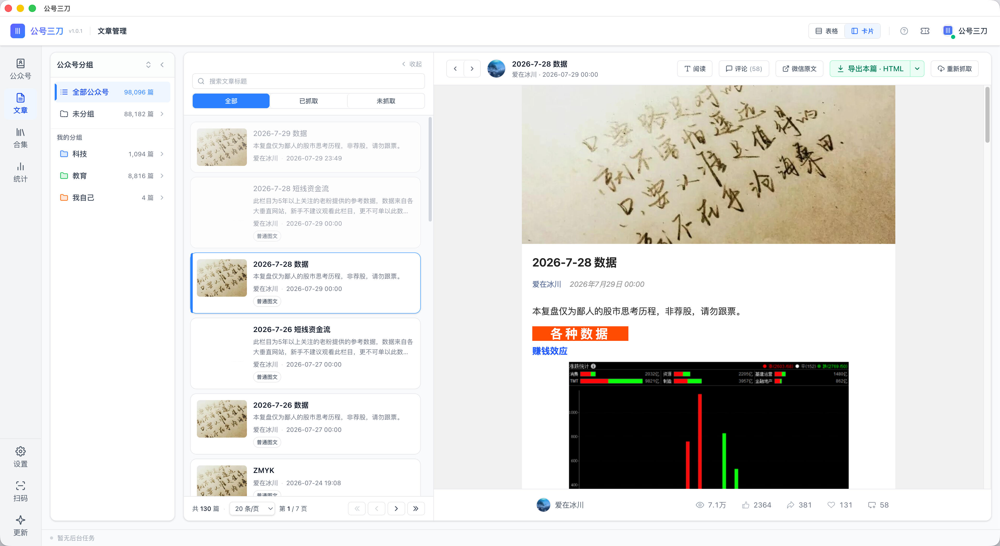
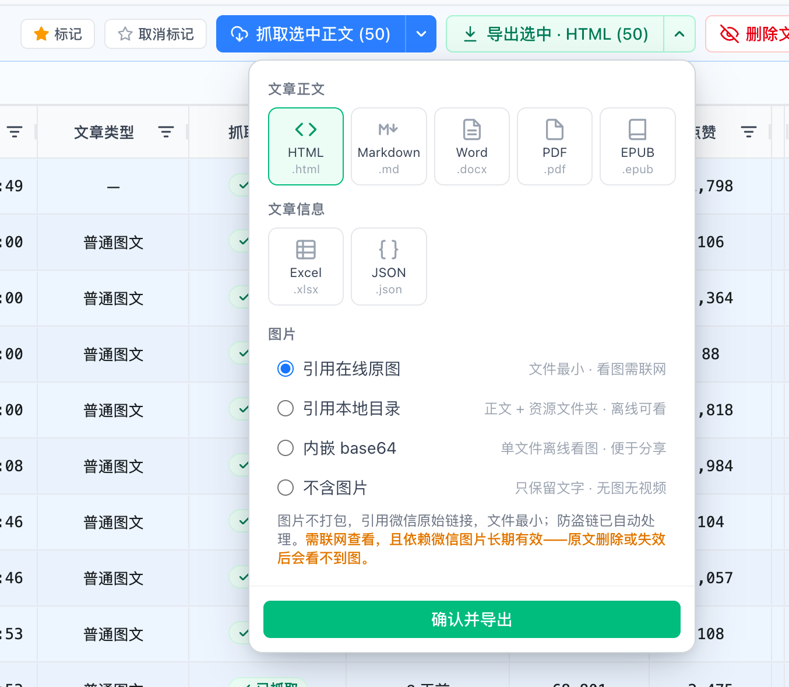

# 公号三刀

**把任意公众号文章完整搬回本地**

添加公众号 → 同步文章 → 抓取正文，导出归档（HTML / Markdown / Word / PDF / EPUB）。
 
图文与排版原样保留，离线随时可读。**不需要你自己拥有公众号。**

[⬇️ Windows 客户端][dl-win] · [⬇️ macOS（Apple 芯片）][dl-mac] · [⬇️ macOS（Intel）][dl-mac-x64]

公开下载 · 关注公众号领码注册 · 支持 Windows 与 macOS（Apple 芯片 / Intel）

---

## 这是什么

公号三刀是一款**微信公众号文章下载桌面客户端**（支持 Windows 与 macOS，后者兼容 Apple 芯片与 Intel 芯片）。把想留的公众号加进列表，在本机微信里取一次「微信凭证」，就能把它的历史图文连同排版与图片/视频完整抓取到本地，然后离线阅读，或一键导出成 HTML / Markdown / Word / PDF / EPUB 长期归档。

- 📦 **原样保留**：图文排版、配图与样式照搬，离线打开和在微信里看几乎一致。
- 🗂️ **批量高效**：跨多个公众号搜索、抓取、导出，一次处理成百上千篇。
- 🔌 **开箱即用**：抓取通道由我们维护，无需自己折腾代理；没有自己的公众号也能用。
- 💻 **本地优先 · 离线归档**：抓取的文章存在本机，离线随时可读，数据握在自己手里。
- 🪟 **托盘常驻 · 后台运行**：关闭窗口即收进系统托盘继续跑，同步 / 抓取 / 导出等任务不中断。
- 🚀 **不限抓取额度 · 本地无容量限制**：抓取正文不计额度，本地存储不设容量上限。
- 🔒 **凭证可控**：微信凭证只保存在你本机、不上传，只能读到你在微信里本就能看到的内容。

---

## 下载与安装

- **Windows**（Windows 10 及以上，x64）：[下载安装包][dl-win]（或前往 [Releases][download] 取 `sanji-<版本>-setup.exe`），双击安装即可。
- **macOS**：Apple 芯片（M 系列）取 [下载安装包][dl-mac] / `sanji-<版本>-arm64.dmg`，Intel 芯片取 [下载安装包][dl-mac-x64] / `sanji-<版本>-x64.dmg`（或前往 [Releases][download]）；打开后拖入「应用程序」即可。不确定芯片？点开屏幕左上角  →「关于本机」查看。
- **自动更新**：安装一次后，客户端会自动检查并在后台静默下载更新，无需再手动下载。

> **使用前提**：① 登录已激活的**公号三刀账号**（在我们的网站注册并激活，不是你的微信账号）；② 本机装有**微信电脑版**并已登录——同步文章列表与抓取互动数据都要在微信里取一次[微信凭证](#微信凭证)。
>
> **不需要拥有自己的公众号。** 从**广场**挑选、或**粘贴一条文章链接**直接添加，两条路都不需要任何微信公众号登录。详见下方[三步开始](#三步开始)。

---

## 核心功能

### 1. 添加公众号（三种方式）

在「公众号管理」页把号加进来，三种方式任选，数量不限，其中两种**不需要登录**：

- **广场**：点顶栏「广场」，按分类浏览我们精选的公众号，一键添加；也可在广场内按关键词搜索。
- **按文章链接添加**：点顶栏「添加公众号」切到这一栏，粘贴该号任意一篇文章的链接即可，客户端会直接解析出这个号。
- **按名称添加**（不再推荐）：输入名称关键词搜索添加。这一条走微信的公众号名称搜索接口，需要先完成「公众号登录」——也就是得你自己拥有一个公众号。上面两种没有这个门槛，效果也一样。

若你此前用过开源版的导出工具，已添加的公众号可在那边「批量导出」为 JSON 文件，回到客户端点顶栏「导入 / 导出」→「从文件导入」，选文件或拖拽，即可一次性导入、免去逐个重搜。

### 微信凭证

同步文章列表、抓取互动数据，都要用到一份**微信凭证**——按公众号各存一份，在你**本机的微信**里获取，用于同步文章列表时约 30 分钟有效，用于抓互动数据时约 90 分钟。

取法很简单：在客户端顶栏右上角的票据图标（鼠标悬停时显示「微信凭证」）里，对目标公众号点「获取」，客户端会把该号的一条链接自动复制到剪贴板；切到微信，粘到「文件传输助手」发送并点开这篇文章，**等它在微信里加载完**，凭证就自动到手了。首次获取会安装一份本地证书、并临时调整系统代理，系统可能弹一次授权框，只需授权一次、结束后自动还原；凭证只保存在你本机、不上传。

由于同步文章列表用的凭证只有约 30 分钟，**建议一个号一个号来**：取一个号的凭证、马上同步这一个号。一次给多个号取好凭证再一起同步，排在后面的号往往还没轮到就已经过期了。

需要留意**覆盖范围**：这条采集通道读的是微信里的历史消息流，只能取到**群发推送**的文章，**仅发表未群发的文章**取不到。这类文章可以在「文章管理 → 按链接抓取」粘贴链接逐条补录。

> 前提：本机装有**微信电脑版**并已登录（支持 Windows 与 macOS）。

### 2. 文章同步与一键抓取正文

可对一个或多个公众号批量发起同步，按发布时间从新到旧同步历史文章列表，支持设置截止时间，并可随时暂停 / 继续 / 取消，实时查看每个号的进度。

同步完成后勾选文章，即可批量把图文正文抓到本地，排版原样保留。感兴趣的文章可点**星标**，用「只看星标」跨公众号筛出后再批量抓取或导出。图片自动重试、缺图会有提示；同一篇文章自动去重，不会重复抓取。

### 3. 离线阅读

内置阅读器，左侧文章列表、右侧正文即点即看，**完全离线**——已抓取的文章无需联网即可阅读。

### 4. 多格式导出（HTML / Markdown / Word / PDF / EPUB / ZIP）

把选中的文章导出为 **HTML / Markdown / Word（DOCX）/ PDF / EPUB**，单篇或批量（批量自动打包成 ZIP）：

- **EPUB 合并成书**：多篇可合并成一本多章 EPUB 电子书，过大时自动分卷；书中视频降级为封面图（不内嵌 mp4）。
- **图片4种模式**（HTML / Markdown）：引用在线原图（文件最小，看图需联网）/ 引用本地目录（正文 + 资源文件夹，离线可看）/ 内嵌 base64（单文件离线看图，便于分享）/ 不含图片（纯文字，不含图片视频）；Word、PDF 图片固定内嵌。
- **目录与文件命名可自定义**。
- 文件直接落到你选定的磁盘目录。

### 5. 托盘常驻 · 关窗后台运行

关闭主窗口不会退出程序——客户端自动收进系统托盘后台运行，同步、抓取、导出等任务照常进行、不受影响；托盘图标实时显示任务进度，任务完成还会弹出系统通知。需要彻底退出时，用托盘菜单的「退出」即可。

### 6. 元数据导出（Excel / JSON）

把选中文章的元数据汇成一份表格或结构化数据，方便统计与归档。包含字段：

> 公众号、标题、作者、发布时间、原文链接、摘要、文章类型、所属合集；阅读数、点赞数、转发数、喜欢数、评论数；是否原创、是否付费、付费金额、星标；抓取状态、微信侧状态、删除标记、缺资源、大小、抓取时间；评论 ID、aid、fakeid。

即文章表格里的全部字段，一篇一行。导出时还可在「设置 → 导出」开启附带每篇正文（Markdown）。其中**阅读 / 点赞 / 转发 / 喜欢 / 评论等互动数据**依赖下面的「抓取互动数据」能力，需先抓取，未抓取的字段会留空。

### 抓取互动数据

「互动数据」指一篇文章的**阅读数、点赞数、转发数、喜欢数、评论数，以及留言内容**等公开互动指标。在「微信凭证」面板获取该号凭证后，即可为选中文章抓取这些数据，补全上面元数据表中的互动字段——**不需要**公众号登录。

---

## 三步开始

> 前提：本机装有微信电脑版并已登录。**不需要**你自己拥有公众号。

| 步骤 | 做什么 |
| :--: | ------ |
| **01 下载并激活** | 下载安装客户端，登录已激活的公号三刀账号（我们网站的账号） |
| **02 添加公众号并取凭证** | 用「广场」挑，或粘一条文章链接把号加进来；再到微信里点开它的一篇文章，自动取到「微信凭证」 |
| **03 同步、抓取与导出** | 同步历史文章列表，一键抓取图文正文，离线阅读或批量导出 HTML / Markdown / Word / PDF / EPUB 归档 |

> **第一步需要邀请码**：注册公号三刀账号为邀请制。用微信**扫码 / 长按识别**下方二维码关注公众号「公号三刀」，关注后会自动收到邀请码和一键注册链接，凭码在[站点](https://app.zoro.build)注册登录。

---

## 购买与授权

- **购买方式**：提供 **1 个月 / 1 年 / 3 年** 三档，按需选择；各档功能完全一致，仅授权时长不同，**提供功能更新与问题修复**。
- **一次性购买、到期不自动续费**：买的是一段固定时长的授权，不会自动扣款；想继续用再买一次即可，时长叠加到现有到期时间上。
- **不限抓取额度**：抓取正文不计额度，已抓取的同一篇自动去重、不重复抓取。
- **本地存储不限容量**：抓取的文章存在本机磁盘，离线可读，不设容量上限。
- 可添加的公众号数量不限，文章元数据导出不限。

> 各档价格见 [站点说明](https://app.zoro.build/#pricing)。登录网站后进「我的授权」页，点「升级 / 续期」选好档位，支付宝扫码付款后即时开通；续期走同一个入口。支付后 7 天内可在「我的订单」自助申请退款（每个账号限一次），退款金额会扣除支付平台收取的手续费（约 1%）；超过 7 天可联系客服，届时还会按已使用的授权时长折算扣除。

---

## 与开源版的关系

公号三刀脱胎于开源项目 **[wechat-article-exporter](https://github.com/wechat-article/wechat-article-exporter)**（在线站点 [down.mptext.top](https://down.mptext.top)），由原作者打造，是它的**商业增强版**。

|           | 开源版                         | 公号三刀（本项目）                                   |
|-----------|-----------------------------|---------------------------------------------|
| 价格        | 完全开源、免费自用                   | 付费使用（7天免费体验，与付费用户功能一致）                      |
| 抓取通道      | 依赖公共代理节点，**每天额度有限、需要"抢额度"** | **由我们维护，开箱即用，不限抓取额度**；网络受限时还可**一键填入自建节点**兜底 |
| 稳定性       | 功能相对有限、可能存在 bug             | 更稳定、功能更丰富，更新更频繁                             |
| 抓取阅读量/评论  | 可以，需手动配置 wxdown 程序          | 无需配置外部程序，软件内集成抓包工具，体验更丝滑                    |
| 导出 PDF 格式 | 线上网站不支持，本地运行支持              | 支持                                          |
| 按文章链接添加号  | 不支持                         | 支持                                          |
| 多账号切换     | 不支持                         | 支持                                          |
| API       | 支持                          | 暂不支持                                        |
| 适合谁       | 愿意自己折腾、动手能力强的用户             | 希望"打开就能用"的普通用户                              |

如果你喜欢折腾、想完全免费自托管，欢迎使用开源版；如果你想省心稳定、不想被代理额度卡住，公号三刀帮你把这些麻烦都解决了。

---

## 常见问题

**支持哪些系统？**
支持 Windows 10 及以上（x64）与 macOS（Apple 芯片与 Intel 芯片均支持）。客户端内置自动更新，安装一次后会自动保持最新。

**用之前需要准备什么？**
两样东西：① 一个**公号三刀账号**（我们网站的账号，在 [app.zoro.build](https://app.zoro.build) 注册并激活，注意它不是你的微信账号）；② **本机的微信电脑版**并已登录——同步文章列表、抓取互动数据都要在微信里取一次[微信凭证](#微信凭证)。**不需要**你自己拥有公众号。

**「公众号登录」还要做吗？**
不建议做。微信关闭公众号后台接口后，它只剩「按名称添加公众号」一个用途，还得你自己拥有一个公众号。从**广场**挑选、或**粘贴一条文章链接**添加，同样能把号加进来，且完全不需要登录。

**同步下来的文章比公众号后台显示的少？**
正常现象。采集通道读的是微信里的历史消息流，只能取到**群发推送**的文章，**仅发表未群发的文章**取不到，这部分差额会长期存在。这类文章可在「文章管理 → 按链接抓取」粘贴链接逐条补录。

**有抓取额度 / 容量限制吗？**
没有。桌面客户端**不限抓取额度**，本地存储也**不设容量上限**；已抓取过的同一篇自动去重、不重复抓取。

**抓取的文章存在哪里？**
存在你本机的磁盘上，离线随时可读；账号与授权信息在云端。

**能抓取阅读 / 点赞等互动数据吗？**
支持。可抓取阅读数、点赞数、转发数、喜欢数、评论数及留言内容——在「微信凭证」面板获取该号凭证后，即可对选中文章抓取，**不需要**公众号登录。

**能抓几个公众号？**
可添加的目标公众号不限数量。

**一个账号能在几台设备上用？**
一个公号三刀账号最多同时激活 2 台设备。客户端「设置 → 账户」可解绑本机；网站「设置」页的「已激活设备」列表可远程解绑任意一台，腾出名额给新设备。

**登录信息安全吗？**
**微信凭证**只保存在你本机、不上传，且只能读到你在微信里本就能看到的公开内容，接触不到你的微信密码、好友、聊天记录、朋友圈。可选的**公众号登录**仅用于代你按名称添加公众号，凭证可在「公众号登录」页随时退出或切换。本工具不会索取或保存你的微信账号密码。

**如何获得使用资格？**
安装包公开可下载，但使用需登录账号；当前注册为邀请制，关注微信公众号「公号三刀」即可自动获取邀请码，凭码前往[站点](https://app.zoro.build)注册登录。

---

## 反馈与建议

本仓库用于发布桌面客户端、收集使用反馈与功能建议。遇到问题、有想要的功能，欢迎[提交 Issue][issue] 告诉我们 🙌

### 找茬计划 · 报告问题换授权时长

发现 app 或网站的 bug、读着别扭的文案？报告并经作者确认属实的问题，**每处 +3 天授权时长，直接加到你的到期时间，永久有效**。

- **什么算**：可复现的功能 bug、明显的文案错误 / 歧义、明确的体验缺陷（app 与网站都算）。
- **怎么领**：统一到 [GitHub Issue][issue] 提交（按 issue 时间认定首位报告者），并在正文附上**找茬码**（客户端「设置 → 账户」或网站「我的授权」页复制）以定位你的账号；附复现步骤 / 截图更易确认。作者确认后加到你账户到期时间，可在客户端「设置 → 账户」看到。
- **最省事的提法**：在客户端「设置 → 账户 → 找茬计划」点**「上报日志并去 GitHub 报告」**——运行日志自动打包上报换成工单号，浏览器打开的 issue 表单里找茬码、工单号、客户端版本都已填好，你只写问题描述即可。带工单号的报告作者能直接调出日志，确认得更快。
- **暂不计入**：旧版已修复的问题（请先更新到最新版复现）、已知 / 重复问题、纯功能建议、无法复现的问题。同一问题只记第一位报告者。
- **没有 GitHub 账号**：在同一张卡片点「没有 GitHub 账号？」，可通过微信公众号「公号三刀」对话、用户群或客服邮箱反馈（把工单号一并发来）。这条路同样受欢迎，只是奖励的「首位报告者」仍按 GitHub issue 时间认定。

> 完整规则见[找茬计划说明](https://app.zoro.build/guide/zhaocha)。

> 公号三刀是第三方文章下载工具，与微信、腾讯公司无隶属或授权关系，不会索取或保存你的微信账号密码。

<!-- 外部链接统一在此维护：改地址只需改这一行 -->
[download]: https://github.com/zoro-build/wechat/releases
[dl-win]: https://dl.zoro.build/sanji/download/win
[dl-mac]: https://dl.zoro.build/sanji/download/mac
[dl-mac-x64]: https://dl.zoro.build/sanji/download/mac?arch=x64
[issue]: https://github.com/zoro-build/wechat/issues
